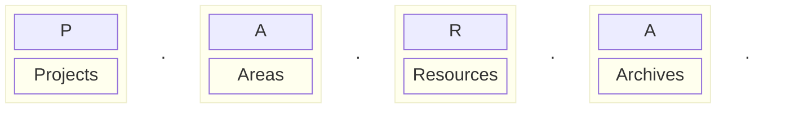
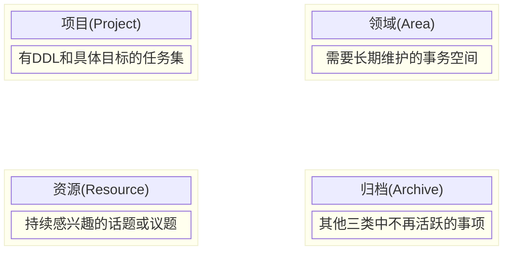

<VPBanner
  title="PARA"
  logo="https://cdn.pkmer.cn/covers/juestchaos.jpeg!nomark"
  :actions='[
    {
      text: "访问",
      link:"https://pkmer.cn/Pkmer-Docs/02-%E7%9F%A5%E8%AF%86%E7%AE%A1%E7%90%86%E5%9F%BA%E7%A1%80/para%E4%BF%A1%E6%81%AF%E7%BB%84%E7%BB%87%E6%B3%95/para%E4%BF%A1%E6%81%AF%E7%BB%84%E7%BB%87%E6%B3%95/",
    },
    {
      text: "作者：OS",
      link: "https://pkmer.cn/authors/os",
      type: "default",
    },
  ]'
/>

PARA 是一个独特的、流行的、包含 Projects、Areas、Resources 和 Archives 四个部分的笔记组织方法。每个部分都有对应的特定用途。通过使用 PARA，你可以更好地管理大量的数字化信息，更轻松地实现知识管理的目标。

在知识管理的领域中，PARA 也是一个非常流行的方法论，它指的是项目（Projects）、领域（Areas）、参考材料（References）和归档（Archives）。

将你的笔记按这四个方面分类是基于以下两个前提的：

第一、分类时要强调使用笔记的目的而不是笔记的来源。换句话说，分类是为了更好的管理你的笔记，而不是让你也能更好的找到他。

第二、思维过程的分类方式与笔记的分类方式不同。不同于思维模式，笔记需要以实用的方式被组织和维护。 通过将你的笔记按照这四个维度进行分类，你可以将笔记们切割成更小的、更易于处理的部分。比如将一张笔记中的待办事项分离出来，并将其移动到待办事项分类下，有效降低笔记压力，同时笔记应用的范围和复杂度也会随之下降。

这一方法论的好处在于它可以将笔记与任务相互绑定，让你在每个笔记的同时也可以管理与之相关的任务。这种细粒度的分类方式不仅让你更有条理地整理数字信息，还可以在帮助你更有效地处理一些复杂的任务或项目的时候提供更好的帮助。与此同时，这种分类法也避免了笔记变得混乱、难以管理的情况，让你的工作和生活更加高效和有条理。

关于 PARA 我们推荐如下的理论、思考和有效实践：

[PARA信息组织法-如何整理我的数字信息](https://pkmer.cn/Pkmer-Docs/02-%E7%9F%A5%E8%AF%86%E7%AE%A1%E7%90%86%E5%9F%BA%E7%A1%80/para%E4%BF%A1%E6%81%AF%E7%BB%84%E7%BB%87%E6%B3%95/para%E4%BF%A1%E6%81%AF%E7%BB%84%E7%BB%87%E6%B3%95-%E5%A6%82%E4%BD%95%E6%95%B4%E7%90%86%E6%88%91%E7%9A%84%E6%95%B0%E5%AD%97%E4%BF%A1%E6%81%AF)

一些类似 PARA 的其他方法论：

[Johnny-Decimal-源于数字编码的管理系统](https://pkmer.cn/Pkmer-Docs/02-%E7%9F%A5%E8%AF%86%E7%AE%A1%E7%90%86%E5%9F%BA%E7%A1%80/para%E4%BF%A1%E6%81%AF%E7%BB%84%E7%BB%87%E6%B3%95/johnny-decimal-%E6%BA%90%E4%BA%8E%E6%95%B0%E5%AD%97%E7%BC%96%E7%A0%81%E7%9A%84%E7%AE%A1%E7%90%86%E7%B3%BB%E7%BB%9F)

[OS的文件简易命名规范](https://pkmer.cn/Pkmer-Docs/02-%E7%9F%A5%E8%AF%86%E7%AE%A1%E7%90%86%E5%9F%BA%E7%A1%80/para%E4%BF%A1%E6%81%AF%E7%BB%84%E7%BB%87%E6%B3%95/os%E7%9A%84%E6%96%87%E4%BB%B6%E7%AE%80%E6%98%93%E5%91%BD%E5%90%8D%E8%A7%84%E8%8C%83)
