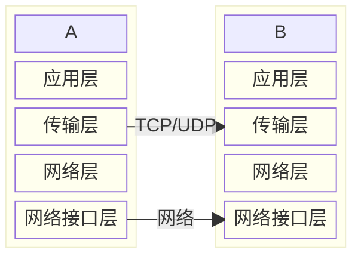
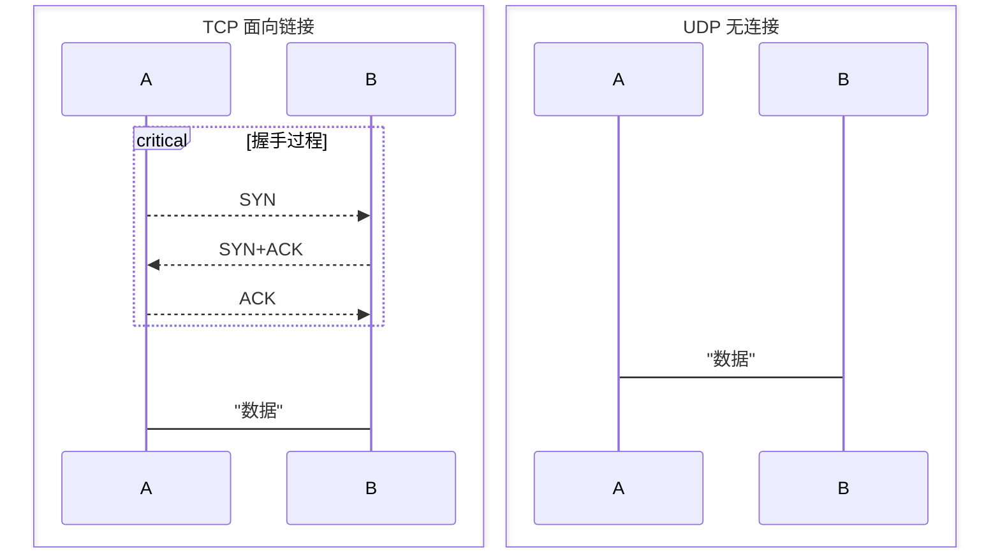
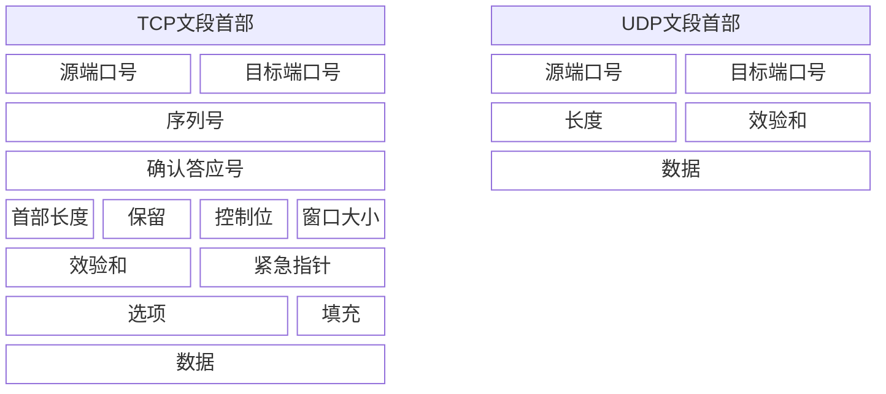
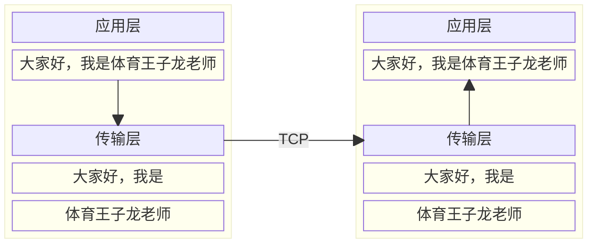
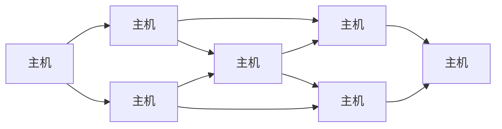
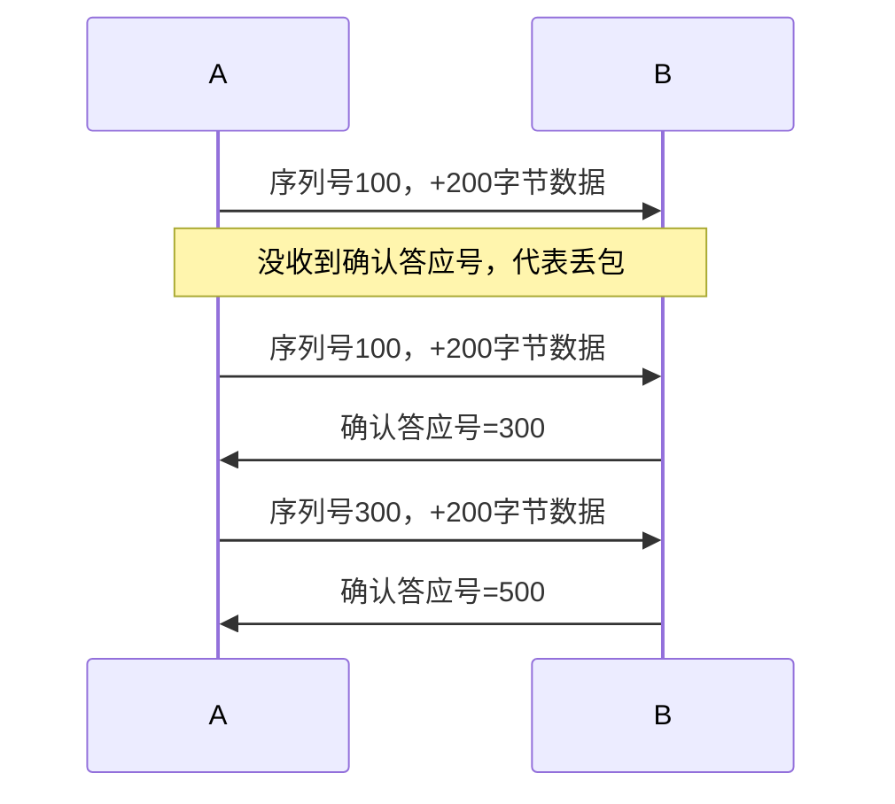
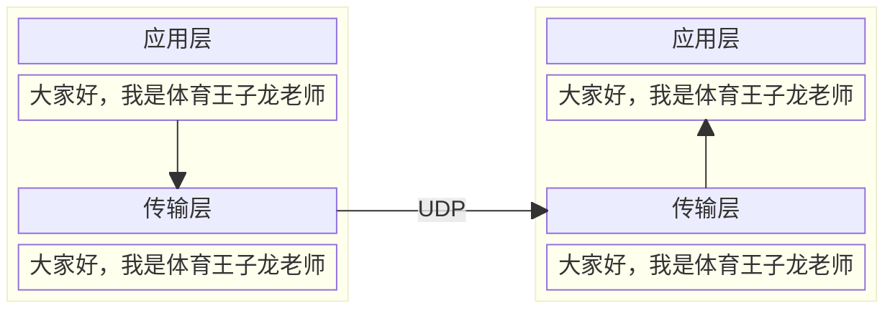

<SiteInfo
  name="理解TCP和UDP协议的核心原理和区别"
  desc="技术蛋老师"
  url="https://www.bilibili.com/video/av113127576376927/"
logo="https://i1.hdslb.com/bfs/face/80384b478798ada204ffd8058b3d156ff5e38bbb.jpg"
  preview="https://cdn.jsdelivr.net/gh/shenbourne/Image-Hosting-Service@main/blog/202409180129894.png"
/>

## 连接类型

传输层提供逻辑通信——提供端口，防止不同应用同时通信时出现问题

### TCP 和 UDP 传输逻辑

TCP是一种面向连接的协议，先进行三次握手，确保一对一服务稳定可靠地传输数据。

UDP无连接，直接发送数据，速度快但不保证数据的完整性和顺序性。

## 首部

TCP和UDP首部构成

TCP与UDP的性能对比

| |TCP|UDP|
|---|---|---|
|首部长度|至少20字节|固定8字节|
|传输特点|开销相对较大|更加轻量化|
|传输速度|速度较慢|速度更快|

## 可靠性和连接方式

### TCP：序列号和确认号

#### 序列号

如果待传送的数据量比较大，TCP就会将其拆为多个数据段，每个数据段都用“序号”进行标注。

TCP将应用层的数据视为“连续”的字节流，并根据实际情况进行分片。将连续的字节流完整的交给对方后对方再组合，应用层便能接收到完整的信息。

TCP将数据包交给网络层，而网络层中数据抵达的顺序往往也不同。此时接收方可以通过序列号丢弃重复数据段，并重组数据。

#### 确认号

如果接收方收到某份数据段，则可用序列号+数据长度的和作为确认号返回。

对于发送方，收到确认号则表明抵达；在指定时间内没收到确认号便代表丢包，TCP进行重传。

因此，TCP的可靠性极大程度依赖于首部中的“序列号”和“确认答应号”。

### UDP：不进行分片

UDP将应用层的每个报文都视为独立的信息，直接封装到网络层

这样不同数据段之间有明显的边界，也要逐个发送以防止乱序；也可以让应用层负责整理乱序数据

因此，UDP虽然不能保证数据的可靠性，但速度极快于TDP

## 流量和拥塞控制

**流量控制**：针对发送双方。在接收方处理速度不足/冗余时，让发送方放慢/加快发送速率。

**拥塞控制**：针对双方中间的网络。TCP能更有效利用网络带宽

由于UDP没有上述控制，其流量需要在不同层面进行管控（如运营商）

## 应用场景

UDP优点：无连接，首部开销小。在数据量小，对速度有较高要求的场景占据优势，如DNS、实时语音、视频通话。

TCP：建立连接，保证数据可靠性。较适合文件传输、网页等需要数据完整性和可靠性的场景。

<Vssue title="Vssue Demo" />