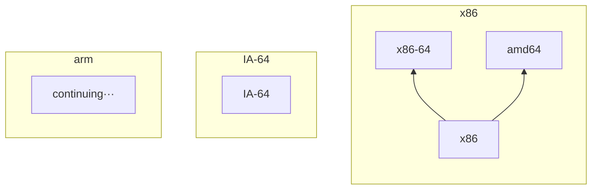

x86 是 Intel 在 1978 年推出的一种 32 位指令集。从 386 时代开始的，一直沿用至今，是一种cisc指令集，所有 Intel 早期的 cpu，amd 早期的 cpu 都支持这种指令集，Intel 官方文档里面称为 “IA-32”。

在2001年，Intel 发布了其最新的 64 位指令集架构 IA-64。但是一反常态，该指令集不能向下兼容 x86，即当时已经发布的软件均无法在该指令集下的 cpu 中运行，市场反应冷淡。现在电脑一般不会存在该指令集架构。

在2003年，amd推出了AMD64，是 x86 的 64 位扩展（即能向下兼容 x86），获得市场的热烈反响。现存许多产品，尤其是在 Intel 发布 x86-64 之前进入市场的 64 位产品，往往采用该指令集架构。

在2004年，Intel 推出了支持 x86 的 64 位指令集架构 x86-64（现在一般简称为x64），后英特尔将其命名为 “Intel 64”。但 Intel 在此架构中吸纳 AMD64，常常被媒体嘲笑。

ARM（英文为Advanced RISC Machine，或Acorn RISC Machine）也是一个架构，非常适用于移动通信这种低成本，高性能，低耗电的领域。常常出现在手机端等，在电脑中很少见。

苹果电脑在采用M系列芯片之前，采用的都是Intel芯片，是x86-64架构。但苹果的M系列芯片采用的是 arm 架构。

Windows电脑区分x32和x64的方法：

按下 Win+R，打开 “运行”，输入 “cmd”，按下 Enter 启动命令提示符

在命令提示符中输入 `systeminfo`，等待数秒。查看“系统类型”，若是 “x64-based PC”，则应分辨是哪个指令集架构。

::: tabs

@tab amd64处理器实例

一般 AMD cpu 的 64 位 pc 是 amd64 指令集架构

@tab:active x86-64处理器实例

一般 Intel cpu 的 64 位 pc 是 x86-64 指令集架构

:::

总结：x86家族的指令集架构分类：

1. x86：一般没有别名
2. x64：
3. amd64：

